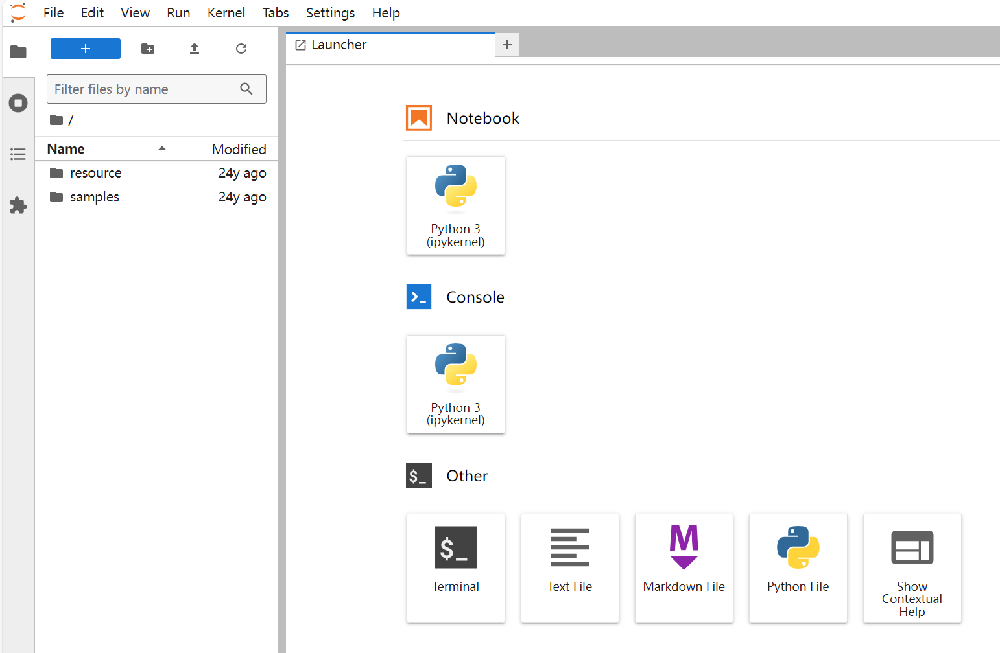
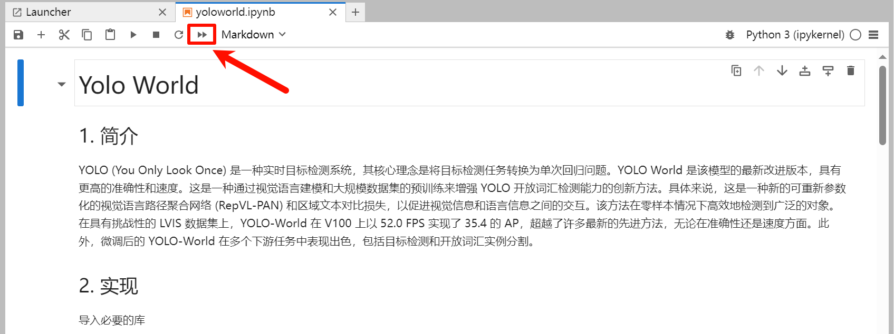
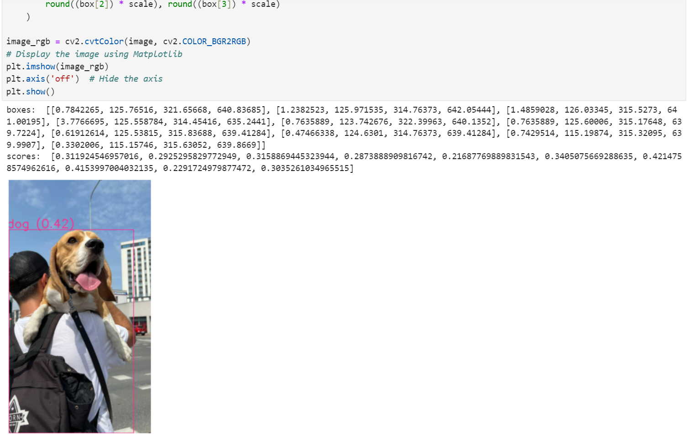

English| [简体中文](./README_cn.md)

RDK X5 Model Zoo
=======

## 1. Product Introduction

This product is the Model Zoo of RDK X5, aiming to provide developers with a variety of model cases that can be directly deployed on the board.

Through this repository, developers can access the following resources:
1. **Diverse D-Robotics heterogeneous models**: The warehouse contains various D-Robotics heterogeneous models that can be directly deployed on the board, suitable for various scenarios, and have strong versatility, including but not limited to .bin models in the fields of image classification, object detection, semantic segmentation, natural language processing, etc. These models have been carefully selected and optimized to have efficient performance.
2. **Detailed user guide**: Each model comes with a jupyter notebook, which includes detailed model introduction, usage instructions, sample code, and comments to help developers get started quickly. At the same time, for some models, we also provide performance evaluation reports and tuning suggestions for the model, which is convenient for developers to customize and optimize according to specific needs.
3. **Integrated Developer Tool**: We provide developers with a set of python interfaces that can quickly deploy models on RDK X3/X5 boards. bpu_infer_lib, by learning the jupyter notebook equipped with models in the warehouse, such as data preprocessing scripts and inference methods, developers can quickly master the use of this interface, greatly simplifying the process of model development and deployment.

## 2. Environmental Preparation

Developers first need to prepare an RDK X5 development kit and go to the X5 official website [TODO supplement link] to complete hardware preparation, driver installation, software download, and mirror flash.

After completing the hardware connection and network configuration, log in to the development board using MobaXTerm, connect to the network of the development kit, and then use the following command to clone the Model Zoo repository:

```
git clone https://github.com/D-Robotics/rdk_model_zoo
```

After the clone is complete, use the following command to enter the Model Zoo directory:

```
cd rdk_model_zoo
```

Then use the following command to enter Jupyter Lab (Note: The IP address is the IP address used by the board for actual login):

```
jupyter lab --allow-root --ip 10.112.148.68
```


After using the command, the above log will appear. Hold down Ctrl and click the link boxed in the figure to enter Jupyter Lab (as shown in the figure below). Double-click "samples" to select the model to experience RDK X5 Model Zoo.



## 3. Module introduction

The RDK X5 Model Zoo is divided into the following modules:

1. **Large Model**: [TODO Supplementary Link]
2. **Image classification**: [TODO supplementary link]
3. **Object Detection**: [TODO Supplementary Link]
4. **Key point detection**: [TODO supplementary link]
5. **OCR**: [TODO Supplementary Link]

Developers can jump into the corresponding module to experience the deployment of the model on X5.

## 4. How To Use

After selecting a model's notebook in Jupyter Lab, the developer will enter an interface similar to the following:



Here, taking the Yolo World model as an example, users only need to click the boxed button in the above figure to run all cells. Scroll to the bottom to see the result display.



Developers can also choose to run cell by cell. At this time, just press Shift + Enter to complete the current cell run and jump to the next cell.