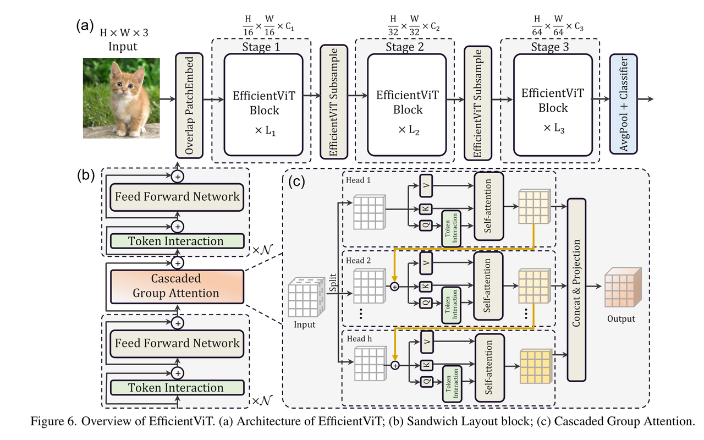
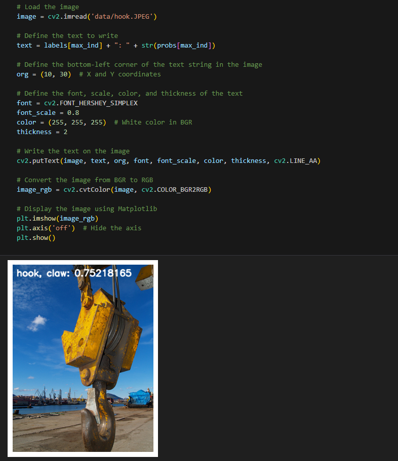

[English](./README.md) | 简体中文

# Transformer - EfficientViT_MSRA

- [Transformer - EfficientViT\_MSRA](#transformer---efficientvit_msra)
  - [1. 简介](#1-简介)
  - [2. 模型性能数据](#2-模型性能数据)
  - [3. 模型下载](#3-模型下载)
  - [4. 部署测试](#4-部署测试)
  - [5. 量化实验](#5-量化实验)

## 1. 简介

- **论文地址**: [EfficientViT: Memory Efficient Vision Transformer with Cascaded Group Attention](https://arxiv.org/abs/2305.07027)

- **Github 仓库**: [EfficientViT_MSRA](https://github.com/microsoft/Cream/tree/main/EfficientViT)

Transformer 计算量大，不适用于实时推理应用。此外，很多实际应用场景对模型实时推理的能力要求较高，但大部分轻量化ViT仍无法在多个部署场景 （GPU，CPU，ONNX，移动端等）达到与轻量级CNN（如MobileNet） 相媲美的速度。


在ViT中，多头自注意力（MHSA）和前馈神经网络（FFN）通常是不可或缺的两个组成模块且交替排列。然而，MHSA中的大量操作如 reshape，element-wise addition，normalization是非计算密集的，因此较多时间浪费在了在数据读取操作上，导致推理过程中只有很小一部分时间用来进行张量计算，如图2所示。


尽管有一些工作提出了简化传统自注意力以获得加速，但是模型的表达能力也受到了一定的影响导致性能下降。因此，本文作者从探索最优的模块排列方式入手，以求减少低效的MHSA的模块在模型中的使用。作者通过减少MHSA和FFN block的方式，构建了多个Swin-T和DeiT-T加速1.25和1.5倍的子网络，每个子网络有着不同的MHSA block比例。对这些子网络进行训练后，作者发现原始Transformer的MHSA和FFN的1：1设计范式并不能实现最优速度-精度权衡，而有着更少的MHSA模块比例（20%~40%）的子网络却可以达到更高的精度



EfficientViT用了overlap patch embedding以增强模型的low-level视觉表征能力。由于BN可以与线性层和卷积层在推理时融合以实现加速，网络中的归一化层采用了BN来替换LN。类似 MobileNetv3 和 LeViT，网络在大尺度下层数更少，并在每个stage用了小于2的宽度扩展系数以减轻深层的冗余

**EfficientViT_msra 模型特点**：

- 从三个维度分析了 ViT 的速度瓶颈，包括多头自注意力（MHSA）导致的大量访存时间，注意力头之间的计算冗余，以及低效的模型参数分配
- 以 EfficientViT block 作为基础模块，每个block由三明治结构 (Sandwich Layout) 和级联组注意力（Cascaded Group Attention, CGA）组成

## 2. 模型性能数据

以下表格是在 RDK X5 & RDK X5 Module 上实际测试得到的性能数据

| 模型                   | 尺寸(像素)  | 类别数  | 参数量(M) | 浮点Top-1  | 量化Top-1  | 延迟/吞吐量(单线程) | 延迟/吞吐量(多线程) | 帧率     |
| -------------------- | ------- | ---- | ------ | ----- | ----- | ----------- | ----------- | ------ |
| EfficientViT_MSRA_m5 | 224x224 | 1000 | 12.4   | 73.75 | 72.50 | 6.34        | 22.69       | 174.70 |


说明: 
1. X5的状态为最佳状态：CPU为8xA55@1.8G, 全核心Performance调度, BPU为1xBayes-e@1G, 共10TOPS等效int8算力。
2. 单线程延迟为单帧，单线程，单BPU核心的延迟，BPU推理一个任务最理想的情况。
3. 4线程工程帧率为4个线程同时向双核心BPU塞任务，一般工程中4个线程可以控制单帧延迟较小，同时吃满所有BPU到100%，在吞吐量(FPS)和帧延迟间得到一个较好的平衡。
4. 8线程极限帧率为8个线程同时向X3的双核心BPU塞任务，目的是为了测试BPU的极限性能，一般来说4核心已经占满，如果8线程比4线程还要好很多，说明模型结构需要提高"计算/访存"比，或者编译时选择优化DDR带宽。
5. 浮点/定点Top-1：浮点Top-1使用的是模型未量化前onnx的 Top-1 推理精度，量化Top-1则为量化后模型实际推理的精度。


## 3. 模型下载

**.bin 文件下载**：

可以使用脚本 [download.sh](./model/download.sh) 一键下载所有此模型结构的 .bin 模型文件，方便直接更换模型。或者使用以下命令行中的一个，选取单个模型进行下载：

```shell
wget https://archive.d-robotics.cc/downloads/rdk_model_zoo/rdk_x5/EfficientViT_MSRA_m5_224x224_nv12.bin
```

**ONNX文件下载**：

onnx 模型使用的是 timm 库 (PyTorch Image Models) 中的模型进行转换的，使用以下命令安装所需要的包：

```shell
pip install timm onnx
```

模型转换以 efficientvit_m5 为例：

```Python
import torch
import torch.onnx
import onnx
from onnxsim import simplify
from timm.models import create_model

from timm.models.efficientvit_msra import efficientvit_m5

def count_parameters(onnx_model_path):
    # Load the ONNX model
    model = onnx.load(onnx_model_path)
    # Get the initializers (weights in the model)
    initializer = model.graph.initializer
    
    # Calculate the total number of parameters
    total_params = 0
    for tensor in initializer:
        # Get the dimensions of each weight
        dims = tensor.dims
        # Calculate the number of parameters in this weight (product of all dimensions)
        params = 1
        for dim in dims:
            params *= dim
        total_params += params
    
    return total_params

if __name__ == "__main__":
    device = torch.device("cuda" if torch.cuda.is_available() else "cpu")
    model = create_model('efficientvit_m5', pretrained=True)
    model.eval()

    # print the model structure

    dummy_input = torch.randn(1, 3, 224, 224, device="cpu")
    onnx_file_path = "efficientvit_m5.onnx"

    torch.onnx.export(
        model,
        dummy_input,
        onnx_file_path,
        opset_version=11,
        verbose=True,
        input_names=["data"],  # Input name
        output_names=["output"],  # Output name
    )
    
    # Simplify the ONNX model
    model_simp, check = simplify(onnx_file_path)

    if check:
        print("Simplified model is valid.")
        simplified_onnx_file_path = "efficientvit_m5.onnx"
        onnx.save(model_simp, simplified_onnx_file_path)
        print(f"Simplified model saved to {simplified_onnx_file_path}")
    else:
        print("Simplified model is invalid!")
        
    onnx_model_path = simplified_onnx_file_path  # Replace with your ONNX model path
    total_params = count_parameters(onnx_model_path)
    print(f"Total number of parameters in the model: {total_params}")
```

## 4. 部署测试

在下载完毕 .bin 文件后，可以执行 test_EfficientViT_msra_*.ipynb 系列的 EfficientViT_msra 模型 jupyter 脚本文件，在板端实际运行体验实际测试效果。需要更改测试图片，可额外下载数据集后，放入到data文件夹下并更改 jupyter 文件中图片的路径



## 5. 量化实验

若想要进一步进阶对模型量化过程中的学习，如选取量化精度、对模型节点进行取舍、模型输入输出格式配置等，可以按顺序在天工开物工具链（注意是在pc端，不是板端）中执行 mapper 文件夹下的shell文件，对模型进行量化调优。

EfficientViT_msra 由于内部带有 softmax 结点，天工开物工具链默认将 softmax 结点放在CPU上执行，需要在yaml配置文件中的 model_parameters 参数下的 node_info 将 softmax 在BPU中进行量化。这里仅仅给出 yaml 的配置文件（在yaml文件夹中），如需进行量化实验可将对应不同大小模型的yaml文件自行替换